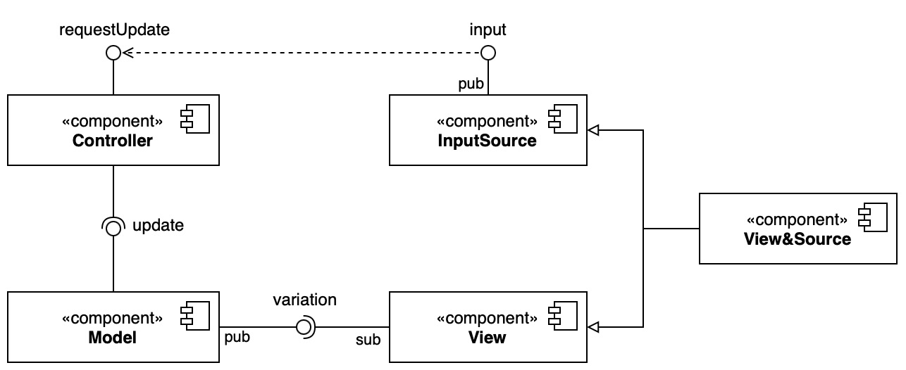
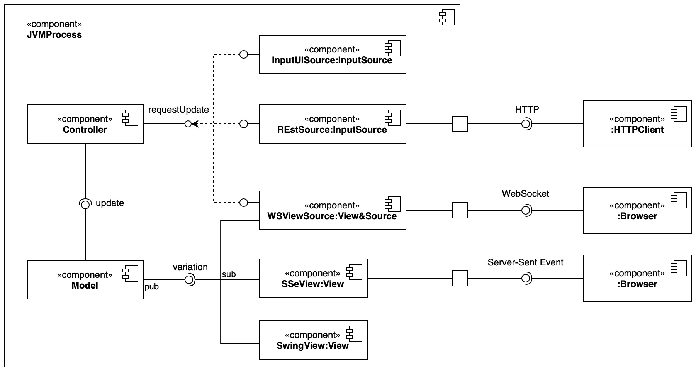

# SAP Assignment 01

## Architettura

L'architettura è basata sul pattern `MVC`, i cui componenti sono:

- `Model`: contiene la logica dell'applicazione (banale, a fini didattici); espone un metodo per poter essere aggiornato. Inoltre, è un **Observable** e permette a tutti gli **Observer** di essere notificati quando viene aggiornato (in questo caso, la *View*).
- `Controller`: unica via di accesso in modifica al **Model**.
- `View`: tutto ciò che permette di visualizzare il **Model**. In questo caso, è un **Observer** del **Model**, a cui si sottoiscrive per essere notificato quando viene aggiornato.

Inoltre, è stata identificata l'interfaccia `InputSource`, che rappresenta una qualsiasi sorgente di input.



## Implementazione

Sono state realizzate le seguenti implementazioni:

- `SSeView`: permette di visualizzare il **Model** tramite interfaccia web. Il **Connettore** utilizzato permette una comunicazione *unidirezionale*, dal processo Java al browser.
- `REstSource`: permette di ricevere un input attraverso il protocollo HTTP. Il **Connettore** utilizzato permette una comunicazione *unidirezionale*, dal client HTTP al browser.
- `WSViewSource`: permette di visualizzare il model attraverso interfaccia web ed inviare input per l'aggiornamento: funge sia da **View** che da **InputSource**. Il **Connettore** utilizzato permette una comunicazione *bidirezionale*, dal processo Java al browser e viceversa.



## Esecuzione

Per eseguire il programma, utilizzare il comando:

```bash
./gradlew run
```

## Dettagli implementativi

Per servire le pagine web accedibili da browser è stato utilizzato il framework [Javalin](https://javalin.io/). La pagina HTML sarà servita in modo statico, la cui logica permette di aggiornare i dati in modo dinamico.

### Endpoints

- `localhost:8000`: view realizzata tramite [**Server Sent Events**](https://developer.mozilla.org/en-US/docs/Web/API/Server-sent_events).
- `PUT localhost:9000/increment`: input source realizzato tramite **REST**. E.g. per incrementare il contatore:
    - ```bash
      curl -X PUT localhost:9000/increment
      ```
    - > A fini didattici è stato inserito anche il metodo `GET`, per poter aggiornare tramite browser.
- `localhost:10000`: view e input source realizzati tramite **WebSocket**.
